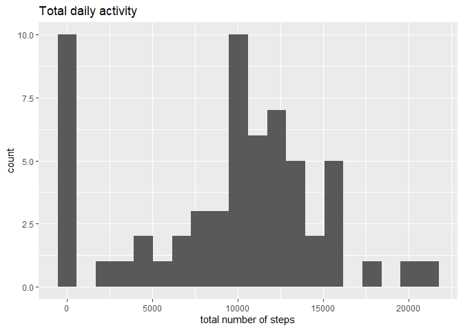
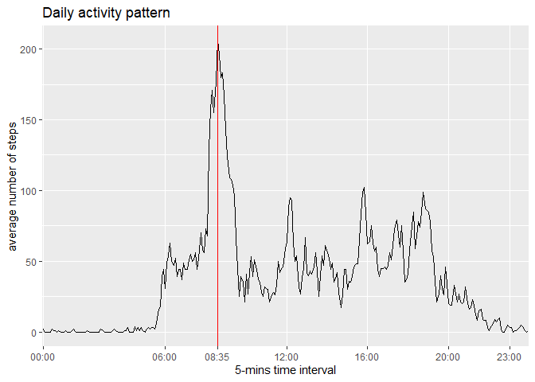
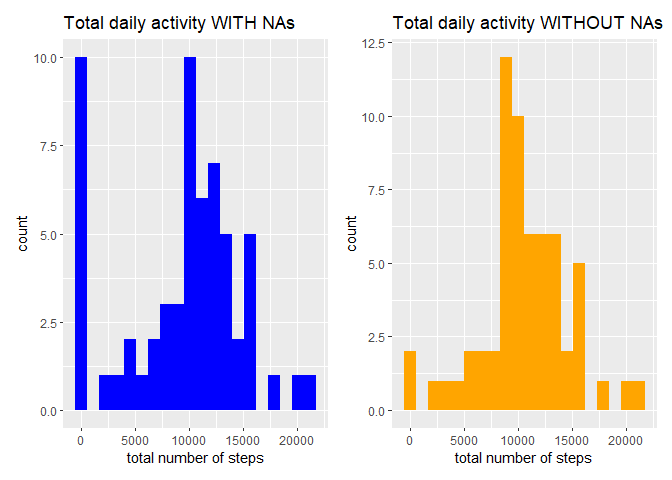
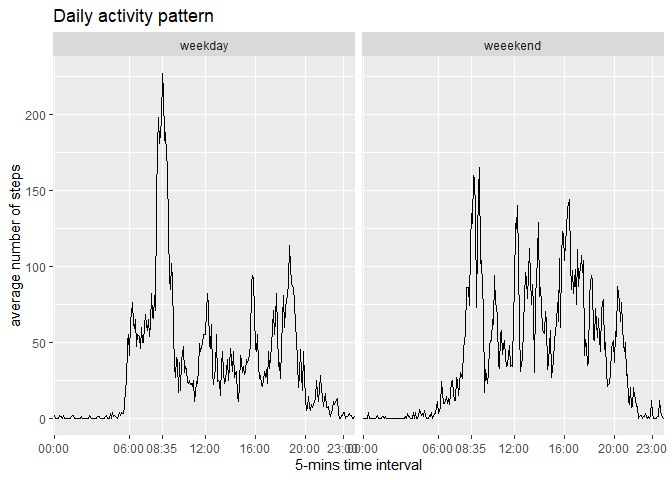

## Load and preprocess the data


```r
activity <- read.csv("activity.csv")
summary(activity)
```

```
##      steps            date              interval     
##  Min.   :  0.00   Length:17568       Min.   :   0.0  
##  1st Qu.:  0.00   Class :character   1st Qu.: 588.8  
##  Median :  0.00   Mode  :character   Median :1177.5  
##  Mean   : 37.38                      Mean   :1177.5  
##  3rd Qu.: 12.00                      3rd Qu.:1766.2  
##  Max.   :806.00                      Max.   :2355.0  
##  NA's   :2304
```

```r
library(dplyr)
```

```
## 
## Attaching package: 'dplyr'
```

```
## The following objects are masked from 'package:stats':
## 
##     filter, lag
```

```
## The following objects are masked from 'package:base':
## 
##     intersect, setdiff, setequal, union
```

```r
library(ggplot2)


activity <- transform(activity, interval=paste(as.character(sprintf("%02d", interval%/%100)), as.character(sprintf("%02d", interval%%100)), sep=":"))
activity <- transform(activity, date=factor(date), interval=factor(interval))

summary(activity)
```

```
##      steps                date          interval    
##  Min.   :  0.00   2012-10-01:  288   00:00  :   61  
##  1st Qu.:  0.00   2012-10-02:  288   00:05  :   61  
##  Median :  0.00   2012-10-03:  288   00:10  :   61  
##  Mean   : 37.38   2012-10-04:  288   00:15  :   61  
##  3rd Qu.: 12.00   2012-10-05:  288   00:20  :   61  
##  Max.   :806.00   2012-10-06:  288   00:25  :   61  
##  NA's   :2304     (Other)   :15840   (Other):17202
```


## What is mean total number of steps taken per day?

```r
stepsbyday <- activity %>% group_by(date) %>% summarize(totalsteps=sum(steps, na.rm=TRUE))
summary(stepsbyday)
```

```
##          date      totalsteps   
##  2012-10-01: 1   Min.   :    0  
##  2012-10-02: 1   1st Qu.: 6778  
##  2012-10-03: 1   Median :10395  
##  2012-10-04: 1   Mean   : 9354  
##  2012-10-05: 1   3rd Qu.:12811  
##  2012-10-06: 1   Max.   :21194  
##  (Other)   :55
```

```r
qplot(totalsteps, data=stepsbyday, bins=20) + labs(title="Total daily activity", x="total number of steps", y="count")
```

<!-- -->

```r
meandailytotal <- round(mean(stepsbyday$totalsteps), digits=0)
```

**Mean** of the total number of steps taken per day is **9354 steps**

**Median** of the total number of steps taken per day is **10395 steps**


## What is the average daily activity pattern?

```r
stepsbyinterval <- activity %>% group_by(interval) %>% summarize(meansteps=round(  mean(steps, na.rm=TRUE), digits=0))
maxstepsinterval <- filter(stepsbyinterval, meansteps == max(meansteps))


ggplot(stepsbyinterval, aes(interval, meansteps, group = 1)) + geom_line() + geom_vline(xintercept=maxstepsinterval$interval, color="red") + labs(title="Daily activity pattern", x="5-mins time interval", y="average number of steps")  + scale_x_discrete(breaks=c("00:00","06:00","08:35","12:00","16:00","20:00", "23:00"))
```

<!-- -->

Maximum mean number of steps during 5-minute interval, on average across all the days in the dataset: **206**

Corresponding interval with the maximum activity: **08:35**


## Imputing missing values
Let's check for the missing values in the dataset

```r
colSums(is.na(activity))
```

```
##    steps     date interval 
##     2304        0        0
```

So, the total number of missing values in the dataset - **2304**, that's 13.1% of the total number of observations.
All these NAs are in the *steps* column.


```r
activityNA <- filter(activity, is.na(steps))
```

#### Days with missing values

```r
datesNA <- unique(activityNA$date)
datesNA
```

```
## [1] 2012-10-01 2012-10-08 2012-11-01 2012-11-04 2012-11-09 2012-11-10 2012-11-14
## [8] 2012-11-30
## 61 Levels: 2012-10-01 2012-10-02 2012-10-03 2012-10-04 ... 2012-11-30
```

```r
length(datesNA)
```

```
## [1] 8
```

Actually, all missing values belong to 8 dates, when no observations were recorded.
For all other days the record is full, no intervals with missing data.


#### Filling in NAs
If we fill in those missing values with average number of steps of the correcponding interval, the total number of steps for that day will be **10762 steps**, that is MORE than mean of the total number of steps taken per day (**9354 steps**). That is, we will make those missing days more active than our average day. To avoid that, we will scale our average numbers of steps per interval by factor "average daily total number of steps / sum of mean number of steps per interval" - (**0.8691693**).

Let's fill in these missing values with the mean value of that time interval scaled by the factor mentioned above.


```r
s <- meandailytotal / sum(stepsbyinterval$meansteps)
activityF <- activity %>% group_by(date) %>% mutate(steps = ifelse(date %in% datesNA, round(stepsbyinterval$meansteps * s, digits=0), steps)) %>% as.data.frame

summary(activity)
```

```
##      steps                date          interval    
##  Min.   :  0.00   2012-10-01:  288   00:00  :   61  
##  1st Qu.:  0.00   2012-10-02:  288   00:05  :   61  
##  Median :  0.00   2012-10-03:  288   00:10  :   61  
##  Mean   : 37.38   2012-10-04:  288   00:15  :   61  
##  3rd Qu.: 12.00   2012-10-05:  288   00:20  :   61  
##  Max.   :806.00   2012-10-06:  288   00:25  :   61  
##  NA's   :2304     (Other)   :15840   (Other):17202
```

```r
summary(activityF)
```

```
##      steps                date          interval    
##  Min.   :  0.00   2012-10-01:  288   00:00  :   61  
##  1st Qu.:  0.00   2012-10-02:  288   00:05  :   61  
##  Median :  0.00   2012-10-03:  288   00:10  :   61  
##  Mean   : 36.74   2012-10-04:  288   00:15  :   61  
##  3rd Qu.: 26.00   2012-10-05:  288   00:20  :   61  
##  Max.   :806.00   2012-10-06:  288   00:25  :   61  
##                   (Other)   :15840   (Other):17202
```


#### How the daily totals changed after we filled in missing values.


```r
stepsbydayF <- activityF %>% group_by(date) %>% summarize(totalsteps=sum(steps, na.rm=TRUE))
summary(stepsbydayF)
```

```
##          date      totalsteps   
##  2012-10-01: 1   Min.   :   41  
##  2012-10-02: 1   1st Qu.: 9358  
##  2012-10-03: 1   Median :10395  
##  2012-10-04: 1   Mean   :10582  
##  2012-10-05: 1   3rd Qu.:12811  
##  2012-10-06: 1   Max.   :21194  
##  (Other)   :55
```

```r
summary(stepsbyday)
```

```
##          date      totalsteps   
##  2012-10-01: 1   Min.   :    0  
##  2012-10-02: 1   1st Qu.: 6778  
##  2012-10-03: 1   Median :10395  
##  2012-10-04: 1   Mean   : 9354  
##  2012-10-05: 1   3rd Qu.:12811  
##  2012-10-06: 1   Max.   :21194  
##  (Other)   :55
```

```r
library(patchwork)
```

```
## Warning: package 'patchwork' was built under R version 4.1.2
```

```r
q1 <- qplot(totalsteps, data=stepsbyday, bins=20, fill = I("blue")) + labs(title="Total daily activity WITH NAs", x="total number of steps", y="count")
q2 <- qplot(totalsteps, data=stepsbydayF, bins=20, fill = I("orange")) + labs(title="Total daily activity WITHOUT NAs", x="total number of steps", y="count")
q1 + q2
```

<!-- -->

```r
meandailytotalF <- round(mean(stepsbydayF$totalsteps), digits=0)
```

**New mean** of the total number of steps taken per day is **10582 steps** (compared to **9354 steps** before filling in NAs).

**New median** of the total number of steps taken per day is **10395 steps** (compared to **10395 steps** before filling in NAs)


## Are there differences in activity patterns between weekdays and weekends?

```r
activityF <- activityF %>% mutate(weekday = weekdays(as.Date(date))) %>% mutate(daycat = factor(1*(weekday %in% c("Saturday", "Sunday")), labels = c("weekday","weeekend")))

stepsbyintervalF <- activityF %>% group_by(daycat, interval) %>% summarize(meansteps=round(mean(steps), digits=0))
```

```
## `summarise()` has grouped output by 'daycat'. You can override using the `.groups` argument.
```

```r
ggplot(stepsbyintervalF, aes(interval, meansteps, group = 1)) + geom_line() + facet_wrap(daycat ~.) + labs(title="Daily activity pattern", x="5-mins time interval", y="average number of steps")  + scale_x_discrete(breaks=c("00:00","06:00","08:35","12:00","16:00","20:00", "23:00"))
```

<!-- -->

So what is the interval with maximum average number of steps?


```r
maxstepsintervalF <- filter(stepsbyintervalF, meansteps == max(meansteps))  %>% as.data.frame
maxstepsintervalF
```

```
##     daycat interval meansteps
## 1  weekday    08:35       227
## 2 weeekend    09:15       165
```
On weekends this person didn't go to work, but was a bit more active throughout the day.
